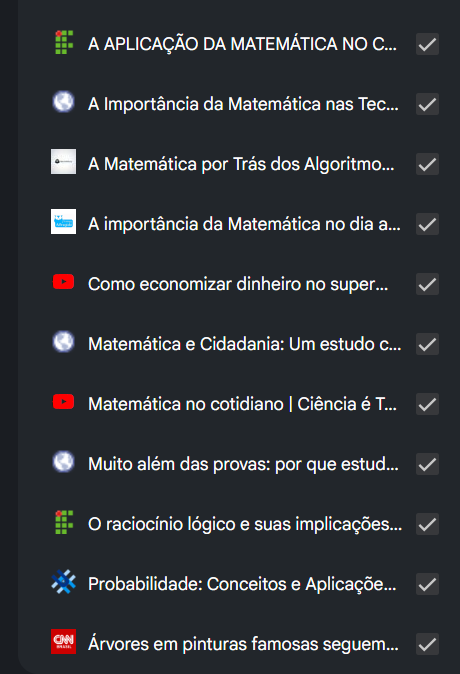
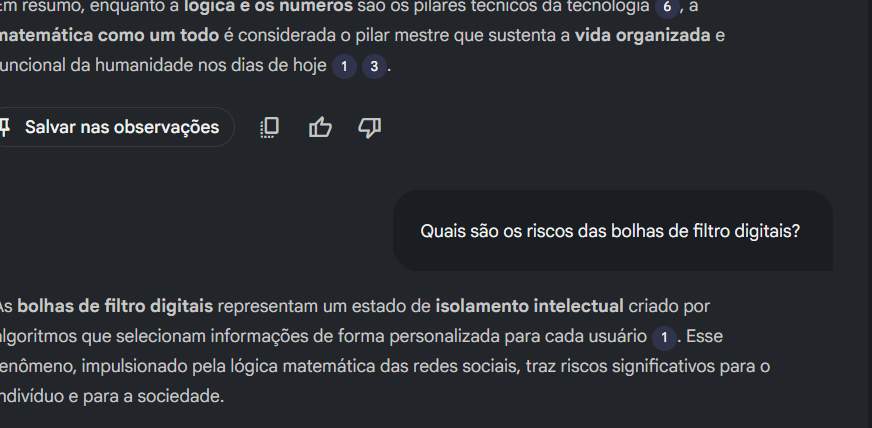

# **Projeto-notebooklm**
___
 Acelere sua Aprendizagem com IA: Explore o Poder do NotebookLM
 
 [Projeto NotebookLM](https://notebooklm.google.com/notebook/420e9359-20cb-41ea-83d2-7ef18f3fe737?authuser=1)
 
 ## **Passos para desenvolver o projeto**

Primeiramente, procurar um tema que faça sentido e que me agregue para poder avançar o conhecimento.

  [x] A importancia da matemática no nosso dia a dia

Apos escolha do tema, foi procura material que agregacomo videos, reportagem, dados ...

!  

assim como no anexo

a partir dai, fiz perguntas coerentes, para ver se a respostas é veridica e ele mostra para que serve.

A experiência foi muito bacana, mostra como se tivesse feito uma IA do zero aonde mostro os beneficiosdo tema especifico dela para quem eu compartilhar, basta alimentar, com conhecimetnos externos como link e dados aonde ela trara informação importante sempre da uma conferida nos assuntos para não ser enganosa ou criada.

ai pedi para ela fazer video sobre o assunto:

C:\Users\renan\Downloads\Muito_Mais_Que_Números.mp4 

